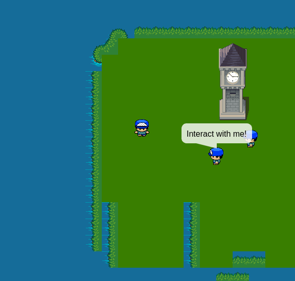

## Phaser.js Tiled integration demo

This project defines an engine to run an adventure game in the browser, and implements a [reference demo game](https://github.com/jacopofar/reference_game) with it.



The "engine" is written in Typescript and uses Phaser.js 3. It can load Tiled maps and supports world files, directly performing chunk load/unload. Tiled objects are parsed to produce actors in the game (NPCs, items), stored in their own JSON.

Such a game can be completely static, or you can have a backend providing tiles and events on the fly.

The game works on mobile and desktop, using multitouch or keyboard.

Additionally, a Python validator is provided, based on JSONSchema.

The game and the engine are kept separated, the game is in the _game\_\_ folder, the "engine", based on Phaser.js, is in the \_src_ folder. By replacing the game folder with another one, you can run another game. This is to later allow game generation using external scripts, or a backend to deliver generated content.

## Run locally

Use `yarn install` and then `yarn run dev-serve` to run a local server that will compile and reload on change.

## Tests

Yep, there are test! Just use `yarn test` to see them.

## Dependencies

You can look at [dependencies_reason.md](dependencies_reason.md) for an explanation about what and why is needed in the project.

## Schemas

The schemas under the schemas folder are used both to validate the files for a project and to generate the Typescript types.
Use `yarn generate-types-from-jsonschema` to regenerate the type files under `src/generated_types`

## Validation

The validation tool can check the game files and report on errors.

Install it with

```
  python3 -m venv .venv
  .venv/bin/python3 -m pip install -r requirements.txt
  python3 -m validator
```

## State of the project

At the moment this code can handle Tiled orthogonal maps with layers and different tiles, and can load/unload chunks using the world file.

Events can define simple dialogs, teleport the player and movement paths.

I am not actively developing it because I now prefer to use Godot and I found Phaser not very suitable for this, in spite of the excellent Typescript support.

However, feel free to use this work! I'm open to pull requests or linking to projects based on/forking it

## License

The code itself is MIT licensed and you can copy and modify it as you wish. The game assets are based on art from other people, detailes in the game README.
